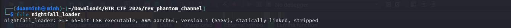
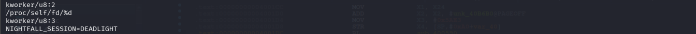
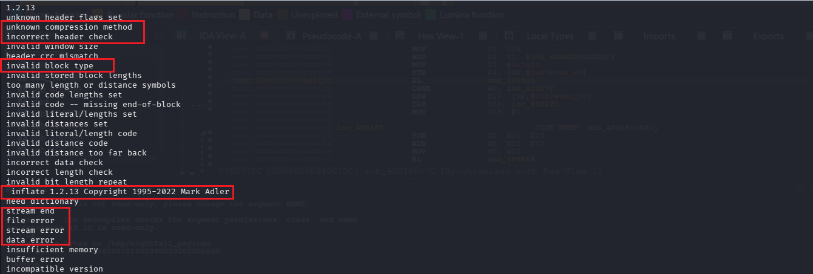
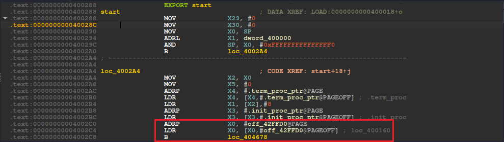
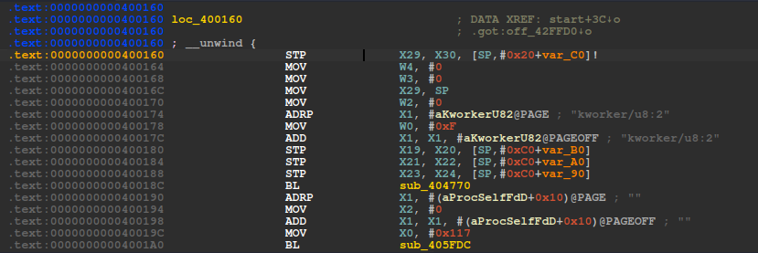
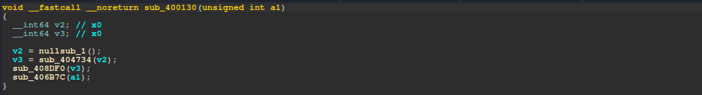
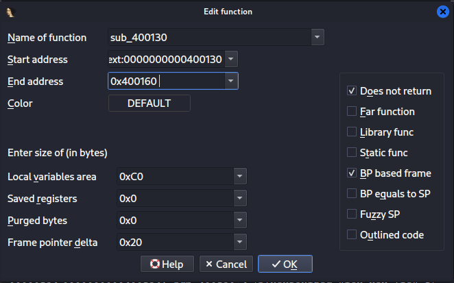
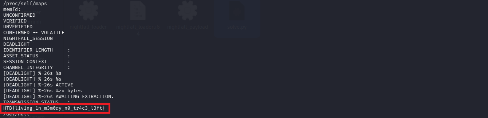

# Phantom Channel

## Tổng quan
- Category: Reverse
- Difficulty: Very Easy (it's hard btw)
- Flag: `HTB{l1v1ng_1n_m3m0ry_n0_tr4c3_l3ft}`

## Mô tả 
- File: [nightfall_loader](files/nightfall_loader)

## Phân tích sơ bộ
Trước tiên kiểm tra bằng `file`:




File là ELF 64-bit kiến trúc ARM64/AArch64. Vì file bị stripped và static linked, dùng IDA sẽ không có sẵn tên hàm như `main`, `malloc`, `write`, `execve`.

Tiếp thử chạy `strings` trên file, ta sẽ thu được một số chuỗi đáng chú ý:




Các chuỗi như `inflate 1.2.13`, `incorrect header check`, `invalid block type`, `stream end` là chuỗi lỗi/copyright của zlib. Đây là dấu hiệu đầu tiên cho thấy binary có khả năng đang giải nén dữ liệu.

Các chuỗi `/proc/self/fd/%d`, `kworker/u8:3`, `NIGHTFALL_SESSION=DEADLIGHT` lại gợi ý một hướng khác: loader có thể tạo file descriptor nào đó, format thành `/proc/self/fd/<fd>`, rồi execute file descriptor này.

## Đào sâu bằng IDA

Mở `nightfall_loader` trong IDA, entry point nằm tại:

```text
0x400288
```

Nếu bấm `Tab` tại entry point, pseudocode chỉ có dạng rất ngắn:

```c
void start()
{
  JUMPOUT(0x404678);
}
```
Đây không phải logic chính của challenge. Đây chỉ là `_start`, tức đoạn startup code của libc/musl. Nó chuẩn bị stack/register rồi nhảy tới routine khởi động.

Trong disassembly của `_start`, đoạn quan trọng là:



IDA comment rằng giá trị load từ `off_42FFD0` trỏ tới `loc_400160`. Đây là function pointer được truyền vào startup routine, tương đương hàm `main` của chương trình.

Lần theo giá trị này tìm đến hàm `loc_400160`, ta có mã assembly của nó:



Ấn `Tab` chuyển sang code giả cho dễ đọc:



Ta phát hiện ra rằng IDA đã phân tích nhầm boundary và coi `0x400160` chỉ là một label nằm trong function `sub_400130`, do đó mà chuyển sang code giả sẽ thành `sub_400130`. Code giả này chỉ có vài dòng gọi startup/helper, không có gì hữu ích.

## Sửa function boundary để xem được pseudocode thật

Ta cần tách `loc_400160` thành một function riêng.

Thao tác trong IDA:

1. Click vào vùng thuộc `sub_400130`.
2. Chuột phải chọn `Edit function...`.
3. Sửa `End address` của `sub_400130` thành `0x400160`



4. Nhấn OK.
5. Bấm `P` để tạo function mới tại `0x400160`.
6. Sửa tên lại thành 'loader_main' cho dễ nhớ.

Sau khi sửa boundary, bấm `Tab` tại `0x400160`, ta thu được pseudocode quan trọng:

```c
void __noreturn sub_400160()
{
  unsigned int v0;
  int v1;
  unsigned int v2;
  __int64 v3;
  _BYTE *v4;
  unsigned __int64 v5;
  unsigned __int64 v6;
  __int64 v7;
  _BYTE *v8;
  _BYTE *v9;
  _QWORD v10[2];
  _QWORD v11[2];
  _QWORD v12[8];

  sub_404770(15, "kworker/u8:2", 0, 0, 0);
  v0 = sub_405FDC(279, "", 0);
  if ( (v0 & 0x80000000) == 0 )
  {
    v1 = v0;
    v2 = v0;
    v3 = sub_404A84(0x400000);
    v4 = (_BYTE *)v3;
    if ( v3 )
    {
      v12[0] = 0x400000;
      if ( (unsigned int)sub_400590(v3, v12, &unk_40B6B0, 23267) )
      {
        sub_404810(v4);
      }
      else
      {
        v5 = v12[0];
        if ( v12[0] )
        {
          v6 = 0;
          do
          {
            v7 = sub_406868(v2, &v4[v6], v5 - v6);
            if ( v7 <= 0 )
              goto LABEL_11;
            v6 += v7;
          }
          while ( v5 > v6 );
          v8 = &v4[v5];
          v9 = v4;
          do
            *v9++ = 0;
          while ( v8 != v9 );
        }
        sub_404810(v4);
        sub_406264(v12, 64, "/proc/self/fd/%d", v1);
        v10[0] = "kworker/u8:3";
        v10[1] = 0;
        v11[0] = "NIGHTFALL_SESSION=DEADLIGHT";
        v11[1] = 0;
        sub_406248(v12, v10, v11);
      }
    }
  }
LABEL_11:
  sub_40685C(1);
}
```

## Phân tích `loader_main`
### Đoạn 1: Tạo file descriptor trong memory
```c
sub_404770(15, "kworker/u8:2", 0, 0, 0);
v0 = sub_405FDC(279, "", 0);
if ( (v0 & 0x80000000) == 0 )
{
  v1 = v0;
  v2 = v0;
  ...
}
```
Dòng đầu đổi tên process/thread thành `"kworker/u8:2"`. Đây là setup phụ, không phải mấu chốt lấy flag.

Đoạn đáng chú ý hơn là:

```c
v0 = sub_405FDC(279, "", 0);
```
- `sub_405FDC` nhận một số ở tham số đầu, sau đó là các tham số syscall.
- Trên Linux AArch64, syscall number `279` là `memfd_create`.
- Hai tham số sau là `""` và `0`, khớp prototype:

```c
memfd_create(const char *name, unsigned int flags);
```

Tiếp theo: Check `(v0 & 0x80000000) == 0` là check syscall không trả lỗi âm.
Return value được copy vào `v1`, `v2`, rồi về sau `v2` được dùng làm tham số đầu của hàm ghi dữ liệu:

```c
sub_406868(v2, &v4[v6], v5 - v6);
```

Điều này cho thấy `v0/v1/v2` là một file descriptor.


**Kết luận**

Đoạn này tạo một file anonymous trong memory:

```c
fd = memfd_create("", 0);
```

Đây là nơi payload sẽ được ghi vào sau khi giải nén.

### Đoạn 2: Tìm lời gọi giải nén payload

```c
v3 = sub_404A84(0x400000);
v4 = (_BYTE *)v3;
if ( v3 )
{
  v12[0] = 0x400000;
  if ( (unsigned int)sub_400590(v3, v12, &unk_40B6B0, 23267) )
  {
    sub_404810(v4);
  }
  else
  {
    v5 = v12[0];
    ...
  }
}
```

`sub_404A84(0x400000)` cấp phát một buffer 4 MB. Buffer vừa cấp phát được truyền vào `sub_400590`.

Trước khi gọi `sub_400590`, chương trình set:

```c
v12[0] = 0x400000;
```

Sau khi gọi thành công, chương trình đọc lại:

```c
v5 = v12[0];
```

Vậy `v12` là pointer tới biến length. Hàm `sub_400590` sẽ nhận bốn tham số:

```text
v3          -> output buffer
v12         -> pointer tới output length
&unk_40B6B0 -> input data
23267       -> input size
```

Đi vào `sub_400590`:

```c
__int64 __fastcall sub_400590(__int64 a1, __int64 a2, __int64 a3, __int64 a4)
{
  __int64 v5;

  v5 = a4;
  return sub_4003D0(a1, a2, a3, &v5);
}
```

Wrapper này biến tham số thứ tư từ value thành pointer rồi gọi `sub_4003D0`. Trong `sub_4003D0` có các dấu hiệu zlib:

```c
sub_400A40(&v20, "1.2.13", 112);
sub_400AF4(&v20, 0);
sub_402450(&v20);
```

Đối chiếu với các strings đã thấy:

```text
inflate 1.2.13 Copyright 1995-2022 Mark Adler
incorrect header check
invalid block type
stream end
```

Prototype zlib `uncompress` có dạng:

```c
int uncompress(Bytef *dest, uLongf *destLen,
               const Bytef *source, uLong sourceLen);
```

Shape này khớp với lời gọi:

```c
sub_400590(v3, v12, &unk_40B6B0, 23267)
```

**Kết luận**

Đây là lời gọi giải nén payload:

```c
out_len = 0x400000;
uncompress(buf, &out_len, &unk_40B6B0, 0x5AE3);
```

Vì `23267 = 0x5AE3`, ta rút ra thông tin quan trọng nhất của bài:

```text
compressed VirAddr   = 0x40B6B0
compressed size = 0x5AE3
```

Trong IDA, nhảy tới `0x40B6B0` và nhìn Hex View sẽ thấy các bytes đầu:

```text
78 DA AC BD ...
```

`78 DA` là header thường gặp của zlib stream. Kết hợp với zlib strings và call shape ở trên, ta xác định đây là blob zlib cần extract.

### Đoạn 3: Ghi payload vào memfd rồi execute
```c
v5 = v12[0];
v6 = 0;
do
{
  v7 = sub_406868(v2, &v4[v6], v5 - v6);
  if ( v7 <= 0 )
    goto LABEL_11;
  v6 += v7;
}
while ( v5 > v6 );

sub_406264(v12, 64, "/proc/self/fd/%d", v1);
v10[0] = "kworker/u8:3";
v10[1] = 0;
v11[0] = "NIGHTFALL_SESSION=DEADLIGHT";
v11[1] = 0;
sub_406248(v12, v10, v11);
```

Sau khi giải nén thành công, `v5 = v12[0]` là size thật của payload. Vòng lặp gọi `sub_406868(v2, &v4[v6], v5 - v6)` cho tới khi ghi đủ `v5` bytes.

Sau đó chương trình tạo chuỗi path từ format string:

```c
"/proc/self/fd/%d"
```

rồi truyền path đó vào `sub_406248` cùng argv/envp.

Đi vào `sub_406868`:

```c
__int64 __fastcall sub_406868(int a1, __int64 a2, __int64 a3)
{
  __int64 v3;

  v3 = sub_408764(64, a1, a2, a3, 0, 0, 0);
  return sub_406B94(v3);
}
```

- Trên Linux AArch64, syscall number `64` là `write`.
- Tham số có dạng `(fd, buffer, size)`.
- Return value được kiểm tra `<= 0`, đúng logic xử lý lỗi của `write`.

Đi vào `sub_406248`:

```c
unsigned __int64 __fastcall sub_406248(const char *a1, char *const *a2, char *const *a3)
{
  return sub_406B94(linux_eabi_syscall(__NR_execve, a1, a2, a3));
}
```

IDA nhận diện trực tiếp syscall là `__NR_execve`.

**Kết luận**

Đoạn này ghi payload đã giải nén vào `memfd`, sau đó execute nó:

```c
write(fd, buf, out_len);
snprintf(path, 64, "/proc/self/fd/%d", fd);

argv = { "kworker/u8:3", NULL };
envp = { "NIGHTFALL_SESSION=DEADLIGHT", NULL };
execve(path, argv, envp);
```

Tới đây có thể kết luận `nightfall_loader` không phải chương trình check flag. Nó là loader chạy một ELF payload chỉ tồn tại trong memory.

## Tổng hợp lại logic `loader_main`

Từ các đoạn mấu chốt, logic tổng thể là:

```c
fd = memfd_create("", 0);
buf = malloc(0x400000);

out_len = 0x400000;
uncompress(buf, &out_len, &unk_40B6B0, 0x5AE3);

write(fd, buf, out_len);
snprintf(path, 64, "/proc/self/fd/%d", fd);
execve(path,
       (char *[]){"kworker/u8:3", NULL},
       (char *[]){"NIGHTFALL_SESSION=DEADLIGHT", NULL});
```

Thông tin cần để extract payload:

```text
compressed VirAddr   = 0x40B6B0
compressed size = 0x5AE3
```

## Extract payload bằng IDAPython

Trong IDA mở `File` -> `Scripts command`, chạy script sau để extract payload:

```python
import ida_bytes
import zlib

ea = 0x40B6B0
size = 0x5AE3

compressed = ida_bytes.get_bytes(ea, size)
print("compressed first bytes:", compressed[:8].hex())

payload = zlib.decompress(compressed)

out_path = "/tmp/nightfall_payload"
with open(out_path, "wb") as f:
    f.write(payload)

print("wrote", len(payload), "bytes to", out_path)
print("payload first bytes:", payload[:16].hex())
```

Output:

```text
compressed first bytes: 78daacbd...
wrote 66856 bytes to /tmp/nightfall_payload
payload first bytes: 7f454c46020101000000000000000000
```

`7f 45 4c 46` là magic bytes của ELF, chứng minh payload sau giải nén là một ELF khác.

## Inspect payload 

Sau khi export được `nightfall_payload`, chạy `strings`:

```bash
strings nightfall_payload
```

Output:



## Flag

```text
HTB{l1v1ng_1n_m3m0ry_n0_tr4c3_l3ft}
```