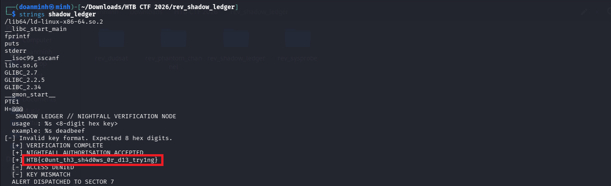
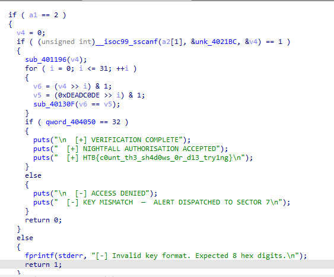
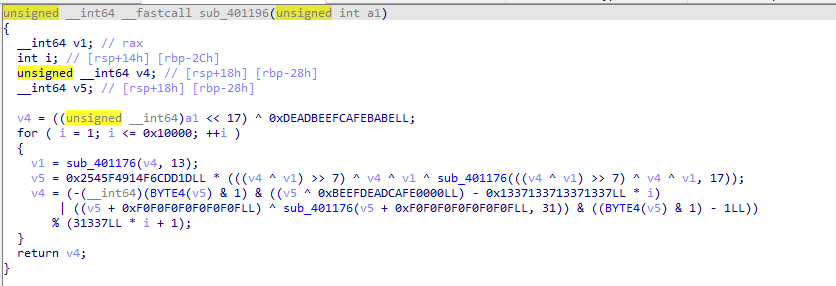
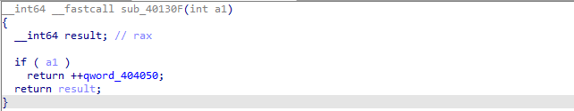
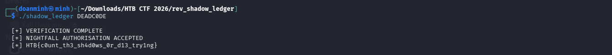

# Shadow Ledger

## Tổng quan
- Category: Reverse
- Difficulty: Easy
- Flag: `HTB{c0unt_th3_sh4d0ws_0r_d13_try1ng}`

## Mô tả 
- File: [shadow_ledger](files/shadow_ledger)

## Phân tích sơ bộ
Trước tiên kiểm tra bằng `strings`:



Hiện ra flag luôn =)))

Nhưng thôi thử tìm hiểu logic hoạt động của chall này là gì

## Đào sâu bằng IDA
Mở file bằng IDA, ta thấy đoạn code `main` như sau:



Đầu tiên chương trình yêu cầu nhập vào 8 kí tự hex, sau đó truyền `v4` đang nhận giá trị 0 vào hàm `sub_401196`:

```C
v4 = 0;
if ( (unsigned int)__isoc99_sscanf(a2[1], &unk_4021BC, &v4) == 1 )
{
    sub_401196(v4);
```

Đi vào hàm này ta thấy biến `v4` sẽ bị mix lộn xộn lên bằng 1 đống phép toán:



Nhưng để ý một chút, đây là truyền tham trị, mà giá trị trả về của hàm này ko đc gán cho biến nào cả, do đó `v4` thay đổi bên trong hàm thì bên ngoài vẫn sẽ bằng 0

Tiếp theo là đoạn code so sánh từng kí tự:

```C
for ( i = 0; i <= 31; ++i )
{
    v6 = (v4 >> i) & 1;
    v5 = (0xDEADC0DE >> i) & 1;
    sub_40130F(v6 == v5);
}
```

Do `v4` vẫn bằng 0 => Đoạn code trên thực chất đang kiểm tra `v6` có bằng `0xDEADC0DE` hay không

Trong hàm `sub_40130F` làm nhiệm vụ đơn giản là nếu kí tự trùng nhau thì biến `qword_404050` sẽ tăng lên 1:



Cuối cùng là đoạn code kiểm tra `qword_404050`:

```C
if ( qword_404050 == 32 )
{
    puts("\n  [+] VERIFICATION COMPLETE");
    puts("  [+] NIGHTFALL AUTHORISATION ACCEPTED");
    puts("  [+] HTB{c0unt_th3_sh4d0ws_0r_d13_try1ng}\n");
}
```

Nếu `qword_404050 == 32` thì sẽ in ra flag, mà để `qword_404050` tăng giá trị lên thì `v6` phải bằng `0xDEADC0DE` 

=> Key đúng để nhập vào chương trình chính là `0xDEADC0DE`

Chạy chương trình với key trên, ta sẽ thấy Flag được in trên màn hình:



## Flag

```bash
HTB{c0unt_th3_sh4d0ws_0r_d13_try1ng}
```
