# Dudsat

## Tổng quan
- Category: Reverse
- Difficulty: Medium
- Flag: `HTB{d0ppl3r_p3rm_l34k_h7b}`

## Mô tả 
File: 
- [lbproc](files/lbproc)
- [comms.dat](files/comms.dat)

## Phân tích sơ bộ
Đầu tiên kiểm tra bằng `file`:

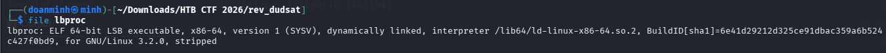

File đã bị stripped, nên khi mở IDA sẽ không có tên hàm rõ ràng. Tiếp theo chạy `strings` để xem có flag hoặc string gợi ý trực tiếp không:

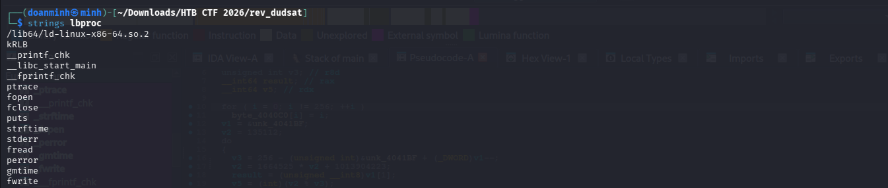

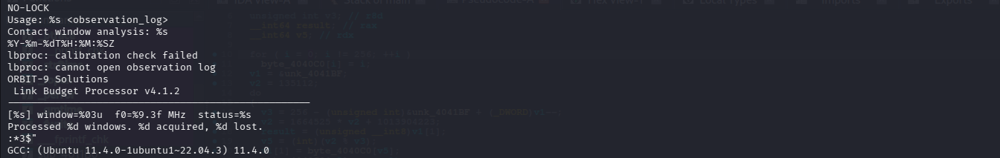

Các string đáng chú ý:

```text
NO-LOCK
LOCK
Usage: %s <observation_log>
Contact window analysis: %s
%Y-%m-%dT%H:%M:%SZ
lbproc: calibration check failed
lbproc: cannot open observation log
ORBIT-9 Solutions - Link Budget Processor v4.1.2
[%s] window=%03u  f0=%9.3f MHz  status=%s
Processed %d windows. %d acquired, %d lost.
```

Từ đây ta biết chương trình nhận một file observation log, tiện đề bài cung cấp cho ta file data `comms.dat`, chạy thử xem sao:

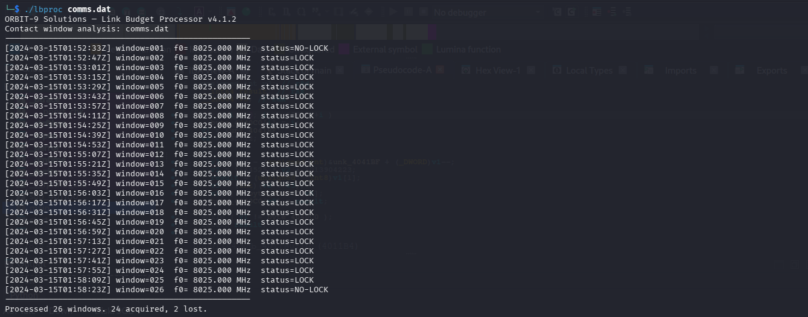

Có 26 dòng record, tương ứng với 26 window ID khác nhau, trong đó có 24 record hiện status `LOCK`, 2 cái còn lại thì hiện `NO-LOCK`. 

Đến đây vẫn chưa hiểu lắm về ý nghĩa của 26 record này, nên tạm thời cứ để đấy và tiến hành mở IDA lên phân tích file `libproc`

## Đọc pseudocode `main`

Mở `lbproc` bằng IDA, tìm hàm `main`. Pseudocode như sau:

```c
__int64 __fastcall main(int a1, char **a2, char **a3)
{
  FILE *v3; // rbp
  int v4; // r13d
  int v5; // r12d
  ........

  v19 = __readfsqword(0x28u);
  if ( ptrace(PTRACE_TRACEME, 0, 0, 0) == -1 )
  {
    fwrite("lbproc: calibration check failed\n", 1u, 0x21u, stderr);
    return 2;
  }
  else if ( a1 == 2 )
  {
    v3 = fopen(a2[1], "rb");
    if ( v3 )
    {
      v4 = 0;
      v5 = 0;
      puts("ORBIT-9 Solutions — Link Budget Processor v4.1.2");
      __printf_chk(1, "Contact window analysis: %s\n", a2[1]);
      puts("---------------------------------------------------");
      while ( fread(&ptr, 0x30u, 1u, v3) == 1 )
      {
        timer = ptr;
        v6 = gmtime(&timer);
        strftime(s, 0x20u, "%Y-%m-%dT%H:%M:%SZ", v6);
        v10 = 0x41B1DE784A000000LL;
        v7 = "NO-LOCK";
        if ( v15 >= 5.0 && v16 >= 12.0 && fabs(v14 - (v13 / 418229116.0 + 1.0) * v12) <= 5000.0 )
          v7 = "LOCK";
        ++v5;
        __printf_chk(1, "[%s] window=%03u  f0=%9.3f MHz  status=%s\n", s, v17, v12 / 1000000.0, v7);
        if ( v15 >= 5.0 && v16 >= 12.0 )
          v4 += fabs(v14 - (v13 / 418229116.0 + 1.0) * v12) <= 5000.0;
      }
      puts("---------------------------------------------------");
      __printf_chk(1, "Processed %d windows. %d acquired, %d lost.\n", v5, v4, v5 - v4);
      fclose(v3);
      return 0;
    }
    else
    {
      perror("lbproc: cannot open observation log");
      return 1;
    }
  }
  else
  {
    __fprintf_chk(stderr, 1, "Usage: %s <observation_log>\n", *a2);
    return 1;
  }
}
```

Tiến hành phân tích thật kĩ hàm `main` này. Đầu tiên là đoạn code dùng kĩ thuật anti-debug khá đơn giản:

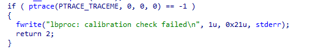

Chương trình gọi `ptrace(PTRACE_TRACEME)` để phát hiện debugger. Nếu đang chạy dưới `gdb`, `strace`, hoặc debugger khác, `ptrace` có thể trả -1. Sau đó là 1 thông báo lỗi giả:

```text
lbproc: calibration check failed
```
Đoạn code này để cấm phân tích động, nhưng thật ra ta vẫn có thể bypass nó 1 cách dễ dàng. Nhưng hãy tiếp tục ưu tiên phân tích tĩnh trước.

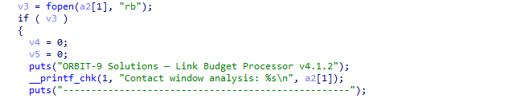

Tiếp theo chương trình sẽ mở file argument ở chế độ binary read, mà ta đã biết chính là file `comms.dat`. 

Nếu đọc thành công, khởi tạo `v4` và `v5` bằng 0. Ở đây `v4` là số record có `status = LOCK`, còn `v5` là tổng số record đã được xử lý. Đoạn code phía sau sẽ giải thích lí do biết được như vậy.

Tiếp đó là các lệnh in ra màn hình, ko có gì đặc biệt.

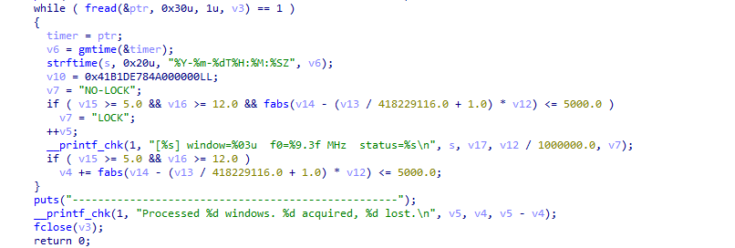

Đến với đoạn code quan trọng nhất của hàm main, đây chính là lõi xử lý file `comms.dat` ta đã nhập vào. 

Mỗi vòng lặp `while ( fread(&ptr, 0x30u, 1u, v3) == 1 )` sẽ đọc `0x30 = 48` byte từ file `v3` vào vùng stack bắt đầu tại `ptr`. Vậy thì `ptr` chính là 1 record, và sau mỗi vòng lặp `ptr` sẽ trỏ đến record tiếp theo.

```C
timer = ptr;
v6 = gmtime(&timer);
strftime(s, 0x20u, "%Y-%m-%dT%H:%M:%SZ", v6);
```
Chương trình lấy vùng thời gian của record đưa vào `gmtime` rồi format thành string UTC.

```C
v10 = 0x41B1DE784A000000LL;
```

Đây là một hằng số 64-bit được ghi vào biến local. Nhìn khá lạ vì không thấy dùng nó ở bất cứ đâu trong code cả.

```C
v7 = "NO-LOCK";
if ( v15 >= 5.0 && v16 >= 12.0 && fabs(v14 - (v13 / 418229116.0 + 1.0) * v12) <= 5000.0 )
    v7 = "LOCK";
++v5;
```

Mặc định status của record là `NO-LOCK`. Ngay dưới chính là 3 điều kiện để status là `LOCK`:
- v15 phải lớn hơn hoặc bằng 5
- v16 phải lớn hơn hoặc bằng 12
- Sai số diff được tính bằng `fabs(v14 - (v13 / 418229116.0 + 1.0) * v12)` phải nhỏ hơn hoặc bằng 5000

Nếu đủ 3 điều kiện, status đổi từ `NO-LOCK` thành `LOCK`.

Cuối cùng là `++v5`. Do `v5` nằm ngoài if nên cứ sau mỗi vòng while `v5` đều tăng thêm 1 => Đó là lí do `v5` chính là biến đếm số lượng record đã xử lý.

```C
__printf_chk(1, "[%s] window=%03u  f0=%9.3f MHz  status=%s\n", s, v17, v12 / 1000000.0, v7);
if ( v15 >= 5.0 && v16 >= 12.0 )
    v4 += fabs(v14 - (v13 / 418229116.0 + 1.0) * v12) <= 5000.0;
```

Chương trình in thông tin từng record ra. Cuối cùng dùng lại cùng điều kiện `LOCK` bên trên để tăng giá trị cho `v4` nếu thoả mãn => `v4` chính là số lượng record `LOCK`.

Ta đã phân tích xong hàm `main`. Vậy thuật toán kiểm tra/tạo flag đâu? Có hàm nào được gọi không? Không hề có! Thế thì làm gì tiếp bây giờ?

Câu trả lời nằm ở dòng `v10 = 0x41B1DE784A000000LL`. Như đã nói phía trên, ta chưa thấy chương trình sử dụng gì đến hằng số này cả. Nhưng có thật là thế ko? Để chuẩn nhất, ta sẽ đổi sang code Assembly để phân tích thử.

## Phân tích code Assembly
Click chuột tại dòng `v10 = 0x41B1DE784A000000LL`, ấn `Tab` chuyển sang Assembly, ta thấy được đoạn code như sau:

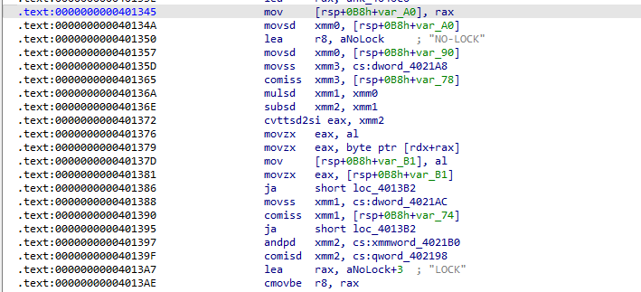

Dựa vào comment của IDA, ta thấy được khoảng cách giữa 2 dòng `NO-LOCK` và `LOCK` là khá lớn, trong khi ở pseudo code chỉ có đúng 1 dòng lệnh `if ( v15 >= 5.0 && v16 >= 12.0 && fabs(v14 - (v13 / 418229116.0 + 1.0) * v12) <= 5000.0 )`. 

Đối chiếu với assembly, ta thấy các lệnh như `movsd` để gán giá trị, `mulsd` thực hiện phép nhân/chia, `subsd` thực hiện phép trừ, `ja` thực hiện nhảy (tương đương với các điều kiện >= và <= ).

Tuy nhiên giữa các lệnh này lại có 1 đoạn lệnh rất khả nghi:

```text
.text:0000000000401372                 cvttsd2si eax, xmm2
.text:0000000000401376                 movzx   eax, al
.text:0000000000401379                 movzx   eax, byte ptr [rdx+rax]
.text:000000000040137D                 mov     [rsp+0B8h+var_B1], al
.text:0000000000401381                 movzx   eax, [rsp+0B8h+var_B1]
```

Lệnh `cvttsd2si` nghĩa là:
```text
Convert with Truncation Scalar Double to Signed Integer
```

Tức câu lệnh `cvttsd2si eax, xmm2` chính là:
```text
eax = (int)xmm2;
```
`xmm2` được tính từ lệnh `subsd   xmm2, xmm1` ngay phía trên, đối chiếu với pseudo code thì `xmm2` chính là giá trị sau số diff => `eax = (int)diff`

Nó sẽ cắt phần thập phân, không làm tròn. Ví dụ:
```text
49.729  -> 49
148.805 -> 148
-12.9   -> -12
```
Lệnh tiếp theo `movzx   eax, al`, `al` là byte thấp nhất của `eax`. Lệnh này nghĩa là:
```text
eax = eax & 0xff;
```
Sau lệnh này, `eax` chắc chắn nằm trong khoảng [0,255].

```text
movzx   eax, byte ptr [rdx+rax]
mov     [rsp+0B8h+var_B1], al
movzx   eax, [rsp+0B8h+var_B1]
```
Tiếp theo là 3 lệnh gán giá trị 1 vị trí trong mảng `byte ptr [rdx+rax]`, sau đó lưu vào trong stack. 

Vấn đề là khi lưu vào stack thì ko thấy bỏ ra dùng nữa, như thể đó là các byte cố tình bị ẩn đi vậy.

## Tìm kiếm các byte ẩn
Trace thanh ghi `rdx` ta thấy được ngay phía trên nó thật sự đc gán cho 1 mảng:
```text
lea     rdx, unk_4040C0
```
Click vào nó, ta thấy:

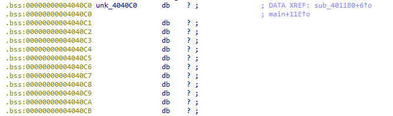

Tổng số bytes của mảng này là 256, hay tức là 256 phần tử, thật trùng hợp là phía trên `eax` nằm trong khoảng [0,255] cũng là 256 giá trị.

Mảng này có xref đến hàm `sub_4011B0`, đi đến đó check logic của hàm:

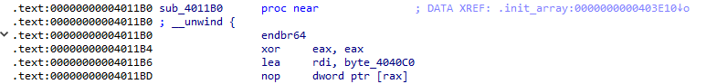

Hàm này nằm trong `init_array`, có nghĩa là dù hàm `main` ko gọi thì nó vẫn sẽ chạy và chạy trước cả hàm `main`. Chuyển sang pseudo code để đọc:

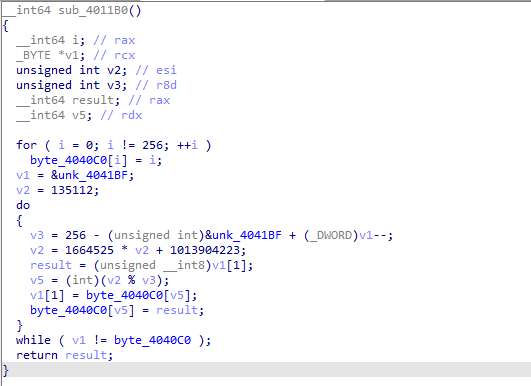

`sub_4011B0` có nhiệm vụ tạo một bảng hoán vị 256 byte từ seed cho trước, và logic code được làm sạch như sau:
```C
uint8_t table[256];

void init_table(void) {
    uint32_t seed = 135112;

    for (int i = 0; i < 256; i++)
        table[i] = i;

    for (int p = 255; p >= 0; p--) {
        seed = seed * 1664525 + 1013904223;
        int j = seed % (p + 1);

        uint8_t tmp = table[p];
        table[p] = table[j];
        table[j] = tmp;
    }
}
```
### Kết luận
Đến đây mọi thứ đã sáng tỏ: `sub_4011B0` tạo 1 lookup_table[256], sau đó `main` dùng nó để lấy 26 byte ẩn sau đúng 26 lần lặp check record.

## Trích xuất byte ẩn

Tạo lại lookup_table[256] theo hàm `sub_4011B0`, sau đó thử lấy vài record đầu, tính byte ẩn theo logic hàm `main` và đổi sang ASCII:

```text
72 84 66 123 ...
```

ASCII:

```text
H T B {
```

Mà flag format là `HTB{...}` => 26 byte ẩn này chính là flag.

## Viết scripts và lấy flag
```python
import struct

RECORD_SIZE = 0x30
CONST = 418229116.0

def build_table():
    table = list(range(256))
    seed = 135112

    for p in range(255, -1, -1):
        seed = (1664525 * seed + 1013904223) & 0xffffffff
        j = seed % (p + 1)
        table[p], table[j] = table[j], table[p]

    return table

def main():
    table = build_table()

    with open("comms.dat", "rb") as f:
        data = f.read()

    out = []

    for off in range(0, len(data), RECORD_SIZE):
        rec = data[off:off + RECORD_SIZE]

        t, a, b, c, m1, m2, win = struct.unpack("<Qdddffi", rec[:44])

        x = (b / CONST + 1.0) * a
        diff = c - x
        idx = int(diff) & 0xff
        ch = table[idx]

        out.append(ch)
        print(f"record={win:03d} diff={diff:9.3f} idx={idx:3d} byte={ch:3d} char={chr(ch)!r}")

    print()
    print(bytes(out).decode())


if __name__ == "__main__":
    main()
```

Chạy scripts trên ta thu được:

```text
HTB{d0ppl3r_p3rm_l34k_h7b}
```

## Flag
```text
HTB{d0ppl3r_p3rm_l34k_h7b}
```
