# Nocteye

## Tổng quan
- Category: Reverse, Crypto, Mobile
- Difficulty: Easy
- Flag: `HTB{n0ct3y3_p4ssphr4s3_pl5_f1l3n4m3_k3y}`

## Mô tả
- [intercept.bin](files/intercept.bin)
- [nocteye.apk](files/nocteye.apk)

## Phân tích sơ bộ
Đây là 1 bài dạng mobile reverse, đầu tiên ta cứ thử tải và chạy file apk trên giả lập Android xem sao:

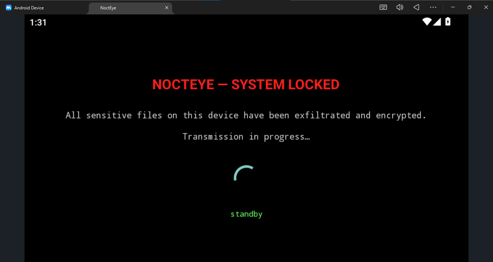

Hiện thông báo mọi file trong máy đã bị mã hoá (thật ra đây là đùa thôi) và ta cũng không tương tác được gì cả.

Ok giờ ta sẽ phân tích mã nguồn file apk này, sử dụng công cụ `jadx` mở file lên, ta có cấu trúc thư mục như sau:

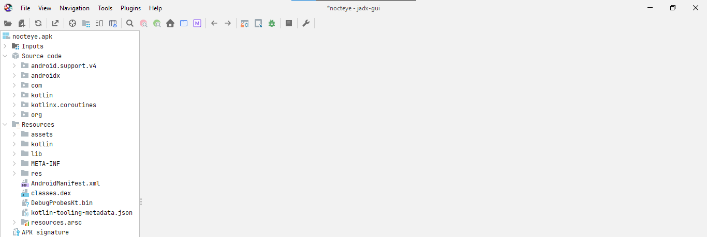

Thông thường file apk khi khởi chạy sẽ gọi hàm tên là `MainActivity`, nhưng với từng file cụ thể thì hàm này sẽ nằm ở vị trí khác nhau. Tuy nhiên có 1 cách chung để tìm được vị trí của nó, đó là check hàm `AndroidManifest`. Mở lên để xem code:

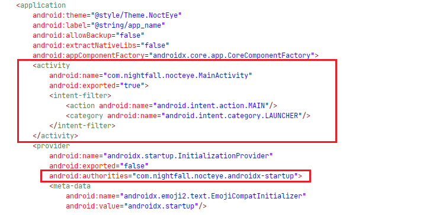

Nhìn vào tag `activity`, ta thấy được `MainActivity` sẽ được gọi từ package `com.nightfall.nocteye`, ở bên dưới chỗ `android-startup` cũng gọi đến package này.

Nhìn sang cây thư mục bên trái, ấn `com`, ấn `nightfall.nocteye`, ta sẽ thấy `MainActivity` nằm ở đó cùng các file khác mang logic hoạt động chính của chương trình:

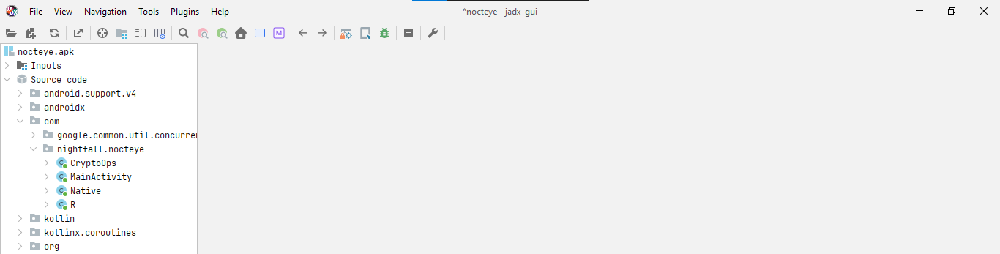

Click `MainActivity` để check code:

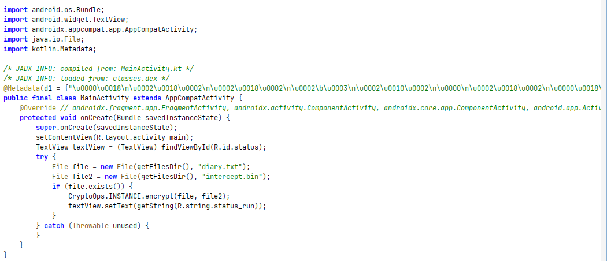

Đầu tiên hàm này chạy `onCreate` để khởi tạo status, content view cùng text view:

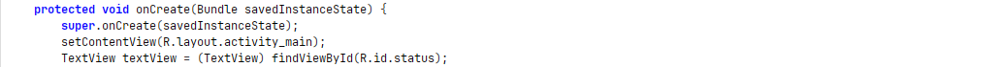

 Đây cũng chỉ là các bước khởi tạo ban đầu để có giao diện app và các dòng chữ hiện trên màn hình, nói chung không có gì để đi sâu hơn.

Đoạn code tiếp theo mới chính là thứ ta cần phải quan tâm:

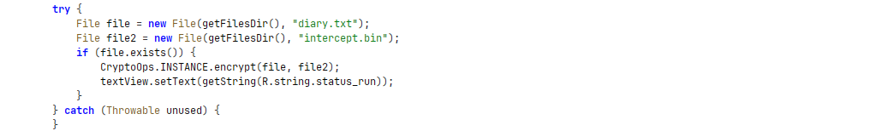

Nó tạo ra 2 file `diary.txt` và `intercept.bin` có kèm cả đường dẫn, điều thú vị là tiếp theo nó gọi hàm `CryptoOps` để mã hoá `diary.txt` thành `intercept.bin`, là cái file trong challenge mà ta nhận được.

Rõ ràng giờ ta sẽ phải tìm cách giải mã ngược lại để lấy được file `diary.txt`, manh mối flag chắc chắn nằm ở đó.

## Phân tích `CryptoOps`
Đi tiếp vào hàm `CryptoOps` để phân tích logic mã hoá:

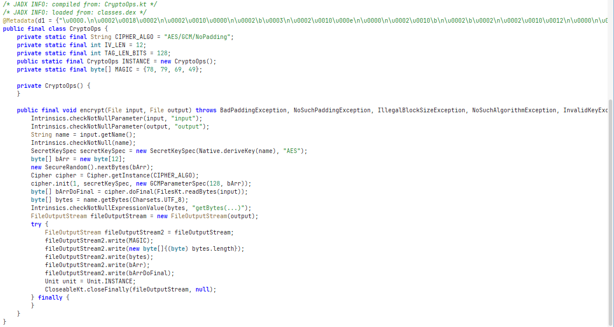

Đầu tiên nó khai báo loại mã hoá cùng các trường thuộc tính của nó:

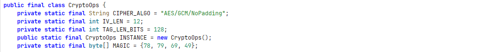

- Chương trình dùng AES ở mode GCM, không padding. GCM là 1 loại mã hoá  xác thực: Đầu ra gồm bản mã hoá và tag xác thực.
- Phần tử khởi tạo IV dài 12 byte. Đây là độ dài chuẩn hay gặp với AES-GCM.
- GCM tag dài 128 bit, tức 16 byte. 
- Magic bytes gồm 78, 79, 69, 49. Chuyển sang ASCII ta được: `NOE1`

Tiếp theo đến hàm `encrypt`:

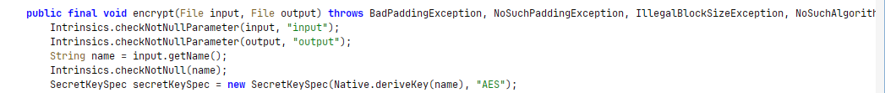

Hai dòng đầu tiên nghĩa là chương trình tự chèn null-check cho `input` và `output` vì trong Kotlin, tham số gốc không được là null. Sau đó là lệnh lấy tên của `input`, ta đã biết đó là `diary.txt`.

Và lệnh cuối cùng cũng là lệnh quan trọng nhất: Gọi `deriveKey` để tạo ra key mã hoá:
```java
SecretKeySpec secretKeySpec = new SecretKeySpec(Native.deriveKey(name), "AES");
```
Nó lấy chính tên file `diary.txt` để làm nguyên liệu tạo key, loại mã hoá là AES, key tạo ra được gán cho biến `secretKeySpec`. Vấn đề ở đây hàm `deriveKey` lại được gọi ở tầng Native, nghĩa là ta sẽ không thể đọc được ở tầng Java hiện tại nữa mà cần đi xuống sâu hơn ở tầng C/C++, thậm chí là Assembly để đọc. 

Tiếp theo là các lệnh tạo giá trị cho các thuộc tính `IV`, `GCM tag`,.... mà ta đã nhắc ở trên:

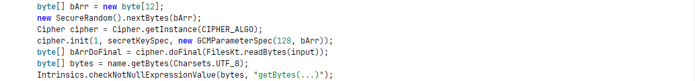

`IV` được tạo ra bằng cách gọi hàm `random` lấy 12 bytes:
```java
byte[] bArr = new byte[12];
new SecureRandom().nextBytes(bArr);
```

Tạo kiểu mã hoá `cipher` là `AES/GCM/NoPadding`:
```java
Cipher cipher = Cipher.getInstance(CIPHER_ALGO);
```

Cung cấp tất cả các thuộc tính cho `cipher`:
```java
cipher.init(1, secretKeySpec, new GCMParameterSpec(128, bArr));
```
`1` là Cipher.ENCRYPT_MODE. Dòng này nghĩa là:
```text
mode = mã hoá 
key  = secretKeySpec lấy từ deriveKey() ở tầng Native
tag  = 128 bit = 16 byte
iv   = bArr (được random ở trên)
```
Đọc toàn bộ nội dung file `diary.txt`, và mã hoá nó:
```java
byte[] bArrDoFinal = cipher.doFinal(FilesKt.readBytes(input));
```
Output sẽ là: 
```text
ciphertext + 16-byte GCM tag
```

Ngoài ra còn lấy tên file là `diary.txt` để chuyển sang UTF-8:
```java
byte[] bytes = name.getBytes(Charsets.UTF_8);
```

Đến với đoạn cuối cùng của hàm `CryptoOps`, các lệnh này sẽ cho ta các thông tin quan trọng:

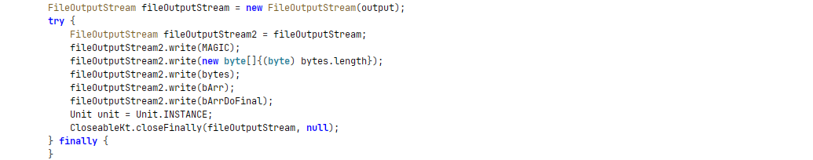

Đầu tiên nó mở file output, ở đây chính là `intercept.bin`. Tiếp theo là 1 loạt lệnh để ghi vào file:
- Ghi magic bytes `NOE1`
- Ghi 1 byte độ dài filename. Ở đây `diary.txt` dài 9 byte, nên sẽ ghi `09`
- Ghi filename `diary.txt`
- Ghi IV 12 byte
- Ghi AES-GCM output: ciphertext + tag

Tóm lại file output `intercept.bin` sẽ có format như sau:
```text
NOE1 || 1 byte độ dài tên file || tên file || 12 byte IV || ciphertext || 16 byte GCM tag
```
## Thu thập IV, GCM tag, ciphertext
Do sử dụng mã hoá AES-GCM nên ta sẽ cần các nguyên liệu sau để có thể tiến hành giải mã:
```text
key        : Cần xuống tầng Native để đọc hiểu hàm `deriveKey` để lấy
IV         : Đã có trong format của intercept.bin
GCM tag    : Đã có trong format của intercept.bin
ciphertext : Đã có trong format của intercept.bin
```

Kiểm tra tổng kích thước của file `intercept.bin`:

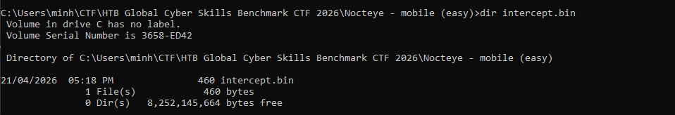

File nặng 460 bytes, lại dựa vào format như trên ta sẽ có:
```text
magic bytes     (4 byte):   từ byte 0 -> 3
độ dài tên file (1 byte):   byte 4
tên file        (9 byte):   từ byte 5 -> 13
IV              (12 byte):  từ byte 14 -> 25
ciphertext      (418 byte): từ byte 26 -> 443 
GCM tag         (16 byte):  từ byte 444 -> 459
```

Chạy lệnh để trích xuất các thông tin này, ta thu được như sau:

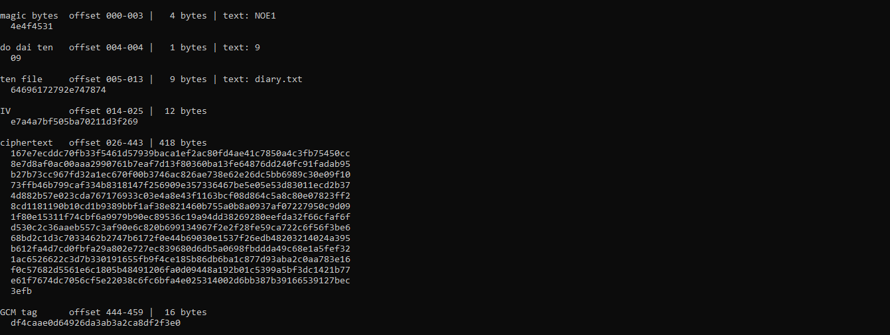

Ta sẽ cần phải nhớ thật kĩ các thông tin này, để sau khi tìm được key còn dùng chúng giải mã file gốc.

## Lặn xuống tầng Native và phân tích bằng IDA
Code chương trình nằm ở tầng Native sẽ được lưu trong các file `.so`. Trên `jadx`, vào `Resources` -> `lib` -> `x86-64`, ta sẽ thấy file `libnocteye.so`:

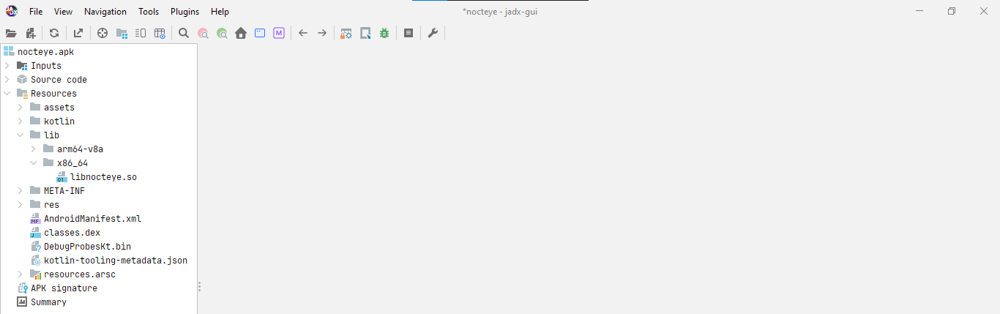

Export file này ra, sau đó dùng IDA mở lên, ta có:

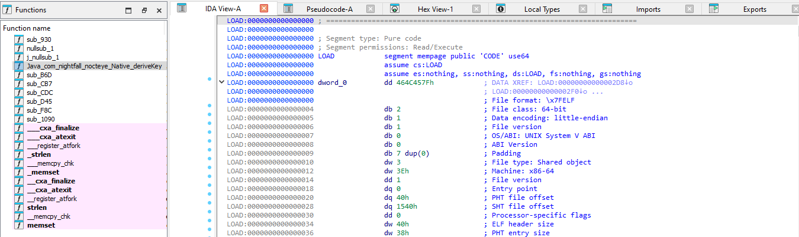

Nhìn sang bên trái, ta thấy hàm `deriveKey`, click vào nó, ấn `Tab` để chuyển sang code giả cho dễ đọc:

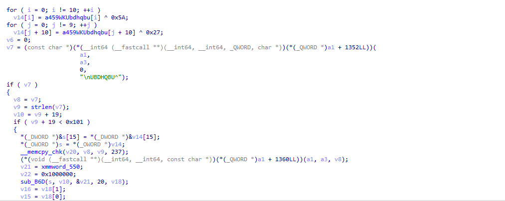

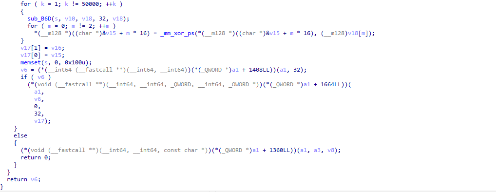

Mở đầu hàm là 2 vòng for xor 1 mảng nào đó với byte cho trước:

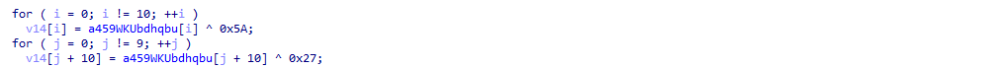

Trong `.rodata` mảng này gồm 19 byte:

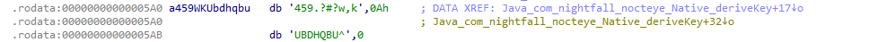

Hai vòng for trên vừa vặn xor 19 byte của mảng này, kết quả thu được là:
```text
nocteye-v1-recovery
```
Nghe khá giống với 1 kiểu password. Đến với các lệnh tiếp theo:

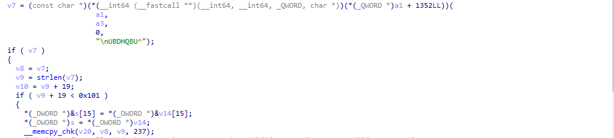

Lấy tên file từ tầng Java, ở đây là `diary.txt`, sau đó lấy độ dài cộng với độ dài chuỗi `nocteye-v1-recovery`, kết quả được 28.

Đoạn copy:
```C
*(_DWORD *)&s[15] = *(_DWORD *)&v14[15];
*(_OWORD *)s = *(_OWORD *)v14;
__memcpy_chk(v20, v8, v9, 237);
```
Thực chất là:
```text
password = "nocteye-v1-recovery" + filename
```
Từ đó ta thu được:
```
password = "nocteye-v1-recoverydiary.txt"
```

Phân tích tiếp các lệnh tiếp theo:

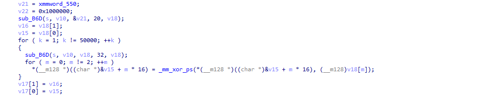

`v21` được gán bởi `xmm_word550`, ấn vào để xem nó chứa giá trị gì:

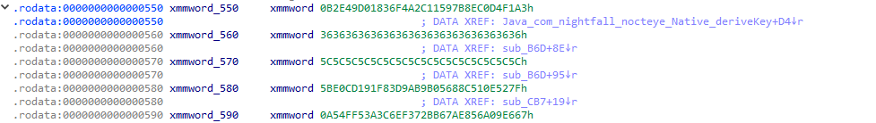

Do IDA lưu trữ kiểu Little-endian nên `xmm_word550` sẽ chứa giá trị thực là:
```text
a3f1d4c08e7b59112c4a6f83019de4b2
```

Nhưng hãy nhìn tiếp các chuỗi byte khác:
```text
xmmword_560 = 36 36 36 ... 36: Đây là ipad của mã hoá HMAC!
xmmword_570 = 5c 5c 5c ... 5c: Đây là opad của mã hoá HMAC!
xmmword_580 = 5BE0CD191F83D9AB9B05688C510E527F
xmmword_590 = A54FF53A3C6EF372BB67AE856A09E667
```
Giá trị mà `xmmword_580` và `xmmword_590` chứa chính là 8 giá trị khởi tạo của thuật toán mã hoá SHA256:
```text
6a09e667
bb67ae85
3c6ef372
a54ff53a
510e527f
9b05688c
1f83d9ab
5be0cd19
```
Đến đây ta gần như chắc chắn key được tạo ra thông qua HMAC-SHA256 rồi, và cái `xmm_word550 = a3f1d4c08e7b59112c4a6f83019de4b2` kia chính là 16 byte salt.

`v22 = 0x1000000` khi nằm trong memory little-endian sẽ thành bytes:
```text
00 00 00 01
```
Đây chính là block index INT_32_BE(1) của PBKDF2. Vậy &v21 dài 20 byte là:
```text
salt || 00 00 00 01
```

Cuối cùng là vòng lặp for chạy 50000 lần thuật toán HMAC-SHA256:

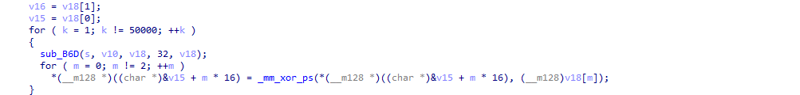

`sub_B6D(s, v10, &v21, 20, v18)` nên đọc là:
```C
v18 = HMAC_SHA256(
    key  = password,
    data = salt || 0x00000001
);
```
Tức là PBKDF2 U1. Sau U1:
```
v16 = v18[1];
v15 = v18[0];
```
v15 || v16 là accumulator T, ban đầu T = U1. Vòng lặp dịch dễ đọc hơn:
```
for (k = 1; k != 50000; ++k)
{
    sub_B6D(s, v10, v18, 32, v18);
    for (m = 0; m != 2; ++m)
        T[m] = T[m] ^ v18[m];
}
```
Nghĩa là:
```
U1 = HMAC(password, salt || 1)
T  = U1

U2 = HMAC(password, U1)
T  = T XOR U2

U3 = HMAC(password, U2)
T  = T XOR U3

...

U50000 = HMAC(password, U49999)
T      = T XOR U50000
```

Đây chính xác là PBKDF2-HMAC-SHA256. 

## Lấy key giải mã
Viết lại scripts Python theo thuật toán PBKDF2-HMAC-SHA256 để lấy key:
```python
import hashlib

key = hashlib.pbkdf2_hmac(
    "sha256",
    b"nocteye-v1-recovery" + b"diary.txt",
    bytes.fromhex("a3f1d4c08e7b59112c4a6f83019de4b2"),
    50000,
    32,
)
```
Kết quả thu được:
```
key = 2ebfde33fe9453c0959beb65dcd1d2280134bbf6f971a60012f85c403b4887d8
```

## Khôi phục file gốc và lấy flag
Đã có được key, kết hợp với IV, GCM tag, ciphertext, ta sẽ viết scripts để khôi phục lại file `diary.txt`:
```python
import hashlib
from pathlib import Path
from cryptography.hazmat.primitives.ciphers.aead import AESGCM

filename = "diary.txt"

iv = bytes.fromhex("e7a4a7bf505ba70211d3f269")

ciphertext = bytes.fromhex(
    "167e7ecddc70fb33f5461d57939baca1ef2ac80fd4ae41c7850a4c3fb75450cc"
    "8e7d8af0ac00aaa2990761b7eaf7d13f80360ba13fe64876dd240fc91fadab95"
    "b27b73cc967fd32a1ec670f00b3746ac826ae738e62e26dc5bb6989c30e09f10"
    "73ffb46b799caf334b8318147f256909e357336467be5e05e53d83011ecd2b37"
    "4d882b57e023cda767176933c03e4a8e43f1163bcf08d864c5a8c80e07823ff2"
    "8cd1181190b10cd1b9389bbf1af38e821460b755a0b8a0937af07227950c9d09"
    "1f80e15311f74cbf6a9979b90ec89536c19a94dd38269280eefd3a2f66cfaf6f"
    "d530c2c36aaeb557c3af90e6c820b699134967f2e2f28fe59ca722c6f56f3be6"
    "68bd2c1d3c7033462b2747b6172f0e44b69030e1537f26edb48203214024a395"
    "b612fa4d7cd0fbfa29a802e727ec839680d6db5a0698fbddda49c68e1a5fef32"
    "1ac6526622c3d7b330191655fb9f4ce185b86db6ba1c877d93aba2c0aa783e16"
    "f0c57682d5561e6c1805b48491206fa0d09448a192b01c5399a5bf3dc1421b77"
    "e61f7674dc7056cf5e22038c6fc6bfa4e025314002d6bb387b39166539127bec"
    "3efb"
)

tag = bytes.fromhex("df4caae0d64926da3ab3a2ca8df2f3e0")
password = b"nocteye-v1-recovery" + filename.encode()
salt = bytes.fromhex("a3f1d4c08e7b59112c4a6f83019de4b2")
key = bytes.fromhex("2ebfde33fe9453c0959beb65dcd1d2280134bbf6f971a60012f85c403b4887d8")

plaintext = AESGCM(key).decrypt(iv, ciphertext + tag, None)

Path(filename).write_bytes(plaintext)
print(f"decrypted to {filename}")
```
Chạy scripts trên, ta thu được file gốc `diary.txt`. Mở lên đọc ta thấy:

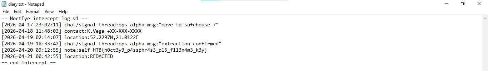

## Flag
```text
HTB{n0ct3y3_p4ssphr4s3_pl5_f1l3n4m3_k3y}
```